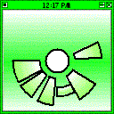



## Cinarian Clock

### Description

A clock using the Cinarian Character Generator (also seen in the Universal Time program) Added an FAQ to read it (click upper left corner)
 
### More Info
 

             |
---                |---
**Submitted On**   |2004-06-06 02:53:26
**By**             |[Techni Rei Myoko](https://github.com/Planet-Source-Code/PSCIndex/blob/master/ByAuthor/techni-rei-myoko.md)
**Level**          |Beginner
**User Rating**    |4.6 (32 globes from 7 users)
**Compatibility**  |VB 6\.0
**Category**       |[Math/ Dates](https://github.com/Planet-Source-Code/PSCIndex/blob/master/ByCategory/math-dates__1-37.md)
**World**          |[Visual Basic](https://github.com/Planet-Source-Code/PSCIndex/blob/master/ByWorld/visual-basic.md)
**Archive File**   |[Cinarian\_C175442662004\.zip](https://github.com/Planet-Source-Code/techni-rei-myoko-cinarian-clock__1-53716/archive/master.zip)

